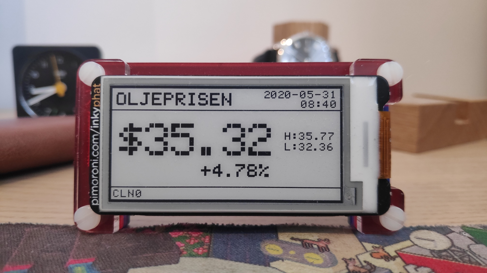

# piOilPriceDisplay 2020 Design Notes
### Raspberry Pi Zero with epaper display that constantly presents the WTI oil price.
script runs periodically, updates screen and then closes.
designed to run on the half hour, every x minutes.
bmd.
https://github.com/duivesteyn/piOilPriceDisplay

2020-05-23 v1.0 - Initial Release
2020-09-04 v1.1 - Minor screen changes

# BOM
- pi zero WIFI
- pimoroni pi w case
- inky phat epaper screen
- sd card
 
## Pre-requisites
- python3
- inkyphat library -> curl https://get.pimoroni.com/inky | bash

# Setup
## Headless installation
- SD Card Flashed with [Raspberry Pi Imager.app](https://www.raspberrypi.org/blog/raspberry-pi-imager-imaging-utility/)
- /Volumes/boot/wpa_supplicant.conf file with WIFI Settings
- create blank file at location /Volumes/boot/ssh to enable ssh access
- Powerup and let the pi connect to your Wifi network. Continue with raspbian setup below.

## Raspbian Setup
- ssh passwordless login. 
- autologin on boot to CLI.
- renamed to piOilPriceDisplay (/etc/hosts)
- user/pass pi:oilpricedisplay
- apt-get update && upgrade
- installed neofetch
- curl https://get.pimoroni.com/inky | bash
- disabled Led in config.txt

## Access
ssh pi@piOilPriceDisplay.local
 
## Installation
1. Get the python files -> git clone https://github.com/duivesteyn/piOilPriceDisplay    
	* This downloads the project files adds them to ~/piOilPriceDisplay
2. Run the script by opening boot.py, or alternatively just open updateDisplay.py to skip the bootscreen
3. Schedule the script to run periodically
	* crontab -e
	* add the following lines:
		* */15 * * * * cd /home/pi/piOilPriceDisplay/ && python3.7 updateDisplay.py
		* @reboot cd /home/pi/piOilPriceDisplay/ && python3.7 boot.py

## Code Structure 
boot.py
> Script that displays the Loading Screen, demonstrates internet connection and cme data pull OK. R
	
updateDisplay.py 
> Script that displays price onto epaper screen (and updates on subsequent runs).

getPrice.py
> Script that gets price from data provider.

printPrice.py 
> Optional code that gets Price and just displays it into the terminal.

## User Interface
There are no user accessible options, all the setup done in python file.

- Loading Screen. 	Shown on Startup for 30 seconds. Visual intro to communicate what device does, link and internet connectivity
- Main Display 		Main Display updated every 30 seconds

LOADING SCREEN

    --------------------------------------------------
    |                                     2020-05-23 |
    |            piOilPriceDisplay v1.0              |
    |                                                |
    |    github.com/duivesteyn/piOilPriceDisplay     |
    |                                                | internet: -> internet: OK (if internet works)		
    |          internet:ok         Data:CME          | Data: -> Data:CME         (when the download reports status 200)
    --------------------------------------------------

MAIN DISPLAY - (Status @ $29.65/bbl)

    --------------------------------------------------
    |                                     2020-05-23 | 
    |            ____  ___     ___   ___             |
    |           (___ \/ _ \   / __) / __)            |
    |            / __/\__  )_(  _ \(___ \            |
    |           (____)(___/(_)\___/(____/            |
    |                                                |
    --------------------------------------------------

# Updates
## v1.1 Flipped 180 degree

*built by bmd, 2020*

