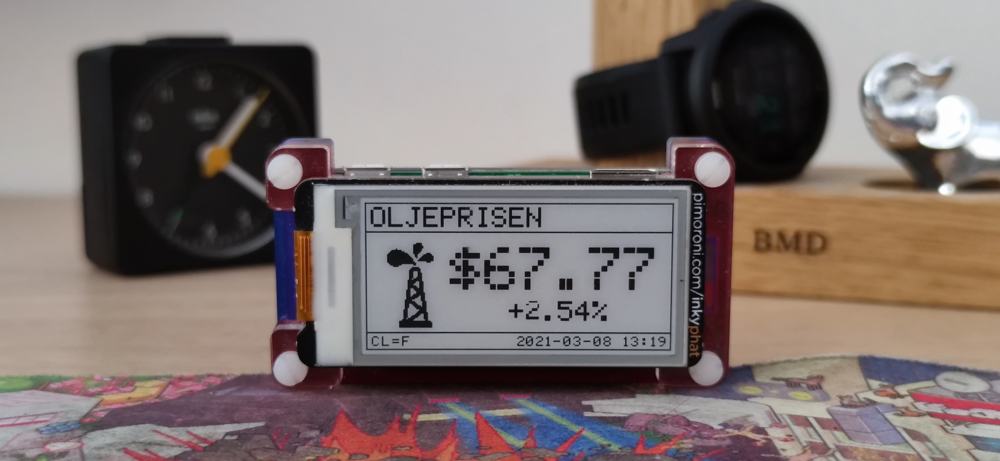
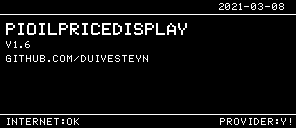
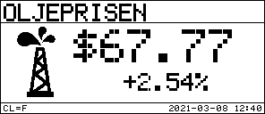

# piOilPriceDisplay Design Notes
### Raspberry Pi Zero with epaper display that constantly presents the WTI oil price.

script runs periodically to get the current oil price, updates an epaper screen with the latest price data.
designed to run every 10 minutes via a cron job.

Supports the [Pimoroni Inky Phat](https://shop.pimoroni.com/products/inky-phat?variant=12549254938707) and [Waveshare 2.9"](https://www.waveshare.com/wiki/2.9inch_e-Paper_Module) ePaper Screens. Generally designed for Raspberry Pi.

Main Site: https://github.com/duivesteyn/piOilPriceDisplay

# BOM
- pi zero WIFI and sd card (OR any internet connected device which runs python3 and has GPIO)
- [inky phat epaper screen](https://shop.pimoroni.com/products/inky-phat?variant=12549254938707)  OR [Waveshare 2.9" ePaper Display](https://www.waveshare.com/wiki/2.9inch_e-Paper_Module)
 
## Pre-requisites
- python3
- inkyphat library (if using that screen type) -> curl https://get.pimoroni.com/inky | bash  

# Setup

## Headless installation
- SD Card Flashed with [Raspberry Pi Imager.app](https://www.raspberrypi.org/blog/raspberry-pi-imager-imaging-utility/)
- /Volumes/boot/wpa_supplicant.conf file with WIFI Settings
- create blank file at location /Volumes/boot/ssh to enable ssh access
- Powerup and let the pi connect to your Wifi network. Continue with raspbian setup below.

## Raspbian Setup
- ssh passwordless login. 
- raspi-config
	- autologin on boot to CLI.
 	- renamed to piOilPriceDisplay (/etc/hosts)
 	- user/pass pi/oilpricedisplay
 	- set timezone
- apt-get update && upgrade
- installed neofetch
- curl https://get.pimoroni.com/inky | bash
- disabled Led in config.txt

## Access

ssh pi@piOilPriceDisplay.local
 
## Installation

1. Get the python files -> git clone https://github.com/duivesteyn/piOilPriceDisplay    
	* This downloads the project files adds them to ~/piOilPriceDisplay
2. Install the requirements -> pip3 install -r requirements.txt 
3. pip3 install --upgrade requests
4. Review Settings in settings.yaml (see settings section below)
5. Run the script by opening boot.py, or alternatively just open updateDisplay.py to skip the bootscreen
6. Schedule the script to run periodically
	* crontab -e
	* add the following lines:
		* */15 * * * * cd /home/pi/piOilPriceDisplay/ && python3.7 updateDisplay.py
		* @reboot cd /home/pi/piOilPriceDisplay/ && python3.7 boot.py

## Application Settings

## Installing Updates

1. cd ~/piOilPriceDisplay && git pull

# Code Structure 

boot.py
> Main Script that runs an intro screen for 5s and then the main view.
	
updateDisplay.py 
> Script that displays price onto epaper screen (and updates on subsequent runs).

# User Interface

The device is a read only display, based upon settings in file settings.yaml

## Settings.yaml

This library is focused only displaying the oil price, so there is very litle configuration required.

- ScreenType = waveshare, inky or terminal - Selects the output screen. 
- Choice1Name = OLJEPRISEN - The header text you would like on the screen (I use it in Norwegian)
- Choice1Icon = oil-tower.png - the icon. Included options are oil-barrel.png, oil-drum.png, oil-drum-1.png, oil-platform.png,oil-pumphjack-extraction.png or oil-tower.png

# Screens

- Loading Screen. 	Shown on Startup for 30 seconds. Visual intro to communicate what device does, link and internet connectivity
- Main Display 		Main Display updated every 30 seconds
- Multiple View Screen - Optional Main Screen

## Loading Screen

## Main Display

# Notes

* Numpy and Pandas are not in the requirements.txt file. pip install pandas isn't the recommended route on linux systems. 
	* sudo apt-get install python3-pandas 
	* See https://numpy.org/devdocs/user/troubleshooting-importerror.html

# Version History

* 2021-03-06 v1.6 - Now supports Waveshare 2.9" ePaper Screen too. (Retains inkyphat as default)
* 2021-02-06 v1.5 - Switched to library bmdOilPriceFetch https://pypi.org/project/bmdOilPriceFetch/ 
* 2021-01-08 v1.4 - Switched to integrated Yahoo Finance API for better longevity.
* 2020-11-22 v1.3 - CME API Free access removed, so switched to Yahoo Finance via Rapid API
* 2020-09-04 v1.1 - Minor screen changes
* 2020-05-23 v1.0 - Initial Release

*built by bmd*